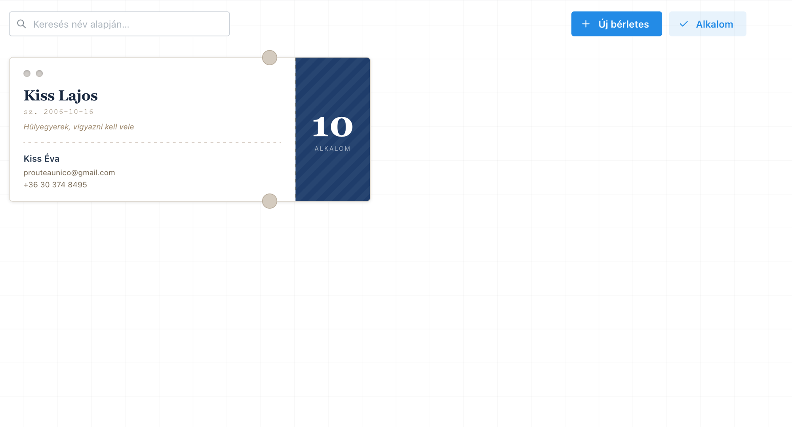
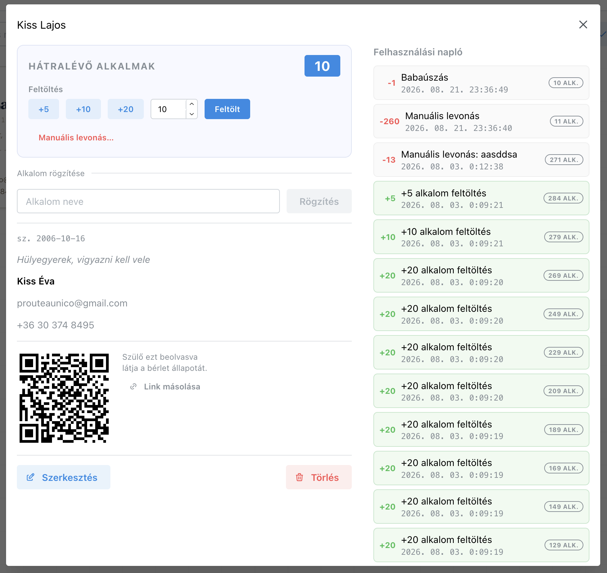
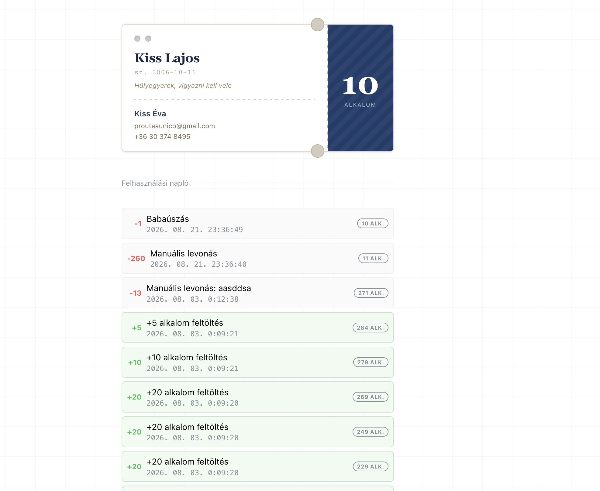

# Berletek

Pass management system built for Gigászok Sportegyesület swimming instructors.

 The instructor manages student passes from a dashboard — creating them, recording sessions (which deduct one credit from each attendee), and topping up balances. Parents receive automatic email notifications and can view their child's pass status via a shareable QR-code link, no login required. Passes can also be created externally via an API key (e.g. triggered by an n8n workflow after a webshop order).

## Flow

```
External system (webshop / n8n)
    ↓
POST /api/external/passes  (API key)  →  pass created, email sent to parent
                                              ↓
                                        Parent opens QR link
                                        GET /pass/:token  →  read-only view

Instructor dashboard
    ├── create / edit pass  →  confirmation email to parent
    ├── record session (select attendees)
    │       ↓
    │   deduct 1 credit from each selected pass  →  email per attendee
    ├── top up balance  →  email to parent
    └── manual deduction  →  logged to ledger (no email)
```

## Features

- **Pass management** — child and parent details, remaining session balance
- **Session recording** — deduct one credit from each selected pass in one click; atomic transaction
- **Top-up / manual deduction** — balance adjustments with a full audit ledger
- **Usage ledger** — every transaction is logged and timestamped
- **QR code / parent link** — parents view their child's pass status without logging in
- **Email notifications** — automatic on pass creation, top-up, and session deduction
- **External API** — create passes from external systems via API key
- **PocketID auth** — OAuth2 login via [PocketID](https://github.com/stonith404/pocket-id)

## Tech stack

| Layer | Technology | Why |
|-------|------------|-----|
| Runtime | [Bun](https://bun.sh) | Built-in HTTP server, SQLite driver, TypeScript bundler — no Express, no Webpack |
| Database | `bun:sqlite` (raw SQL) | Zero dependencies, single file, sufficient for this scale |
| Frontend | React 19 + [Mantine 7](https://mantine.dev) | Modals, notifications, and form primitives out of the box |
| Email | Nodemailer + SMTP | HTML email with inline CID attachments (logo / footer) |
| Auth | [PocketID](https://github.com/stonith404/pocket-id) | Self-hosted OIDC provider |
| Deploy | Single binary (`bun build --compile`) | No runtime dependency; copy binary + `.env` to VPS |

## Project structure

```
backend/
  index.ts          # Bun.serve() entry point, global error handler
  db.ts             # SQLite init, schema, indexes
  schema.ts         # Shared TypeScript types (imported by frontend)
  config.ts         # Typed .env reader
  middleware.ts     # requireAuth() — throws AuthError on failure
  auth.ts           # PocketID OAuth2 flow + JWT sign/verify
  email.ts          # HTML email templates + Nodemailer transport
  pass-ops.ts       # createPass() + passUrl() — shared by internal and external routes
  queries/
    ledger.ts       # buildPassLedger() — reconstructs balance history from events
  routes/
    auth.ts         # /api/auth/*
    passes.ts       # /api/passes/* — CRUD, top-up, deduct, usage ledger
    sessions.ts     # /api/sessions — record session; /api/usage-log
    external.ts     # /api/external/passes — API key protected

frontend/
  index.tsx         # React root
  modules/
    root.tsx              # Auth flow + client-side routing
    dashboard.tsx         # App shell (header, nav)
    passes.tsx            # Pass list with search
    pass-detail-modal.tsx # Balance, top-up, session recording, QR code, ledger
    alkalom-modal.tsx     # Bulk session recording (select multiple passes)
    public-pass.tsx       # Parent view — no auth required
  components/
    pass-ticket.tsx       # Ticket-style card UI
    ledger-row.tsx        # Shared ledger entry row (admin + parent views)
  hooks/
    api-client.ts         # apiFetch wrapper with auth header
    use-passes.ts         # Pass list state
    use-pass-detail.ts    # Selected pass + usage ledger state
```

## Data model

```sql
trainers             id, pocketid_sub, name, email, created_at
passes               id, trainer_id, view_token (unique), child_name, child_birth_date,
                     child_notes, parent_name, parent_email, parent_phone,
                     remaining_sessions, created_at
sessions             id, trainer_id, name, scheduled_at, status, created_at
session_attendance   id, session_id, pass_id, deducted_at
pass_topups          id, pass_id, trainer_id, sessions, created_at
pass_manual_deductions  id, pass_id, trainer_id, sessions, note, created_at
```

Indexes: `idx_passes_child_name`, `idx_pass_topups_pass_id`, `idx_pass_manual_deductions_pass_id`, `idx_session_attendance_pass_id`, `idx_session_attendance_session_id`.

## Running locally

**Prerequisites:** [Bun](https://bun.sh/docs/installation) ≥ 1.1, a running [PocketID](https://github.com/stonith404/pocket-id) instance, an SMTP server.

```bash
git clone https://github.com/nicovok/gigaszok-berletek
cd gigaszok-berletek
bun install
cp .env.example .env   # fill in values
bun run dev            # hot reload on :3000
```

### Environment variables

| Variable | Description |
|----------|-------------|
| `PORT` | HTTP port (default: `3000`) |
| `BASE_URL` | Public base URL (default: `http://localhost:3000`) |
| `POCKETID_CLIENT_ID` | OAuth2 client ID from PocketID |
| `POCKETID_CLIENT_SECRET` | OAuth2 client secret |
| `POCKETID_REDIRECT_URI` | `https://<host>/api/auth/callback` |
| `JWT_SECRET` | HS256 signing key (min. 32 chars) |
| `SMTP_HOST` | SMTP server hostname |
| `SMTP_PORT` | SMTP port (default: `2525`) |
| `SMTP_USR` | SMTP username |
| `SMTP_PASS` | SMTP password |
| `EMAIL_FROM` | Sender address (defaults to `SMTP_USR`) |
| `DB_PATH` | SQLite file path (default: `berletek.db`) |
| `EXTERNAL_API_KEY` | Optional — enables `POST /api/external/passes` |

### Email assets

Place the following images in `backend/`:

| File | Usage |
|------|-------|
| `email-logo.png` | Shown centered in the email header |
| `email-footer.png` | Embedded as footer in every outgoing email |

## Deployment

```bash
# Build a self-contained binary
bun run build   # → ./berletek

# Copy to server
scp berletek .env user@vps:/opt/berletek/
```

Systemd service:

```ini
[Unit]
Description=Berletek
After=network.target

[Service]
WorkingDirectory=/opt/berletek
EnvironmentFile=/opt/berletek/.env
ExecStart=/opt/berletek/berletek
Restart=always
RestartSec=5

[Install]
WantedBy=multi-user.target
```

Pre-built binaries for Linux x64/arm64, macOS x64/arm64, and Windows x64 are attached to every [GitHub Release](https://github.com/nicovok/gigaszok-berletek/releases).

## API reference

### Auth
| Method | Endpoint | Description |
|--------|----------|-------------|
| GET | `/api/auth/login` | Returns OAuth2 redirect URL |
| GET | `/api/auth/callback` | OAuth2 redirect handler |
| GET | `/api/auth/verify` | Validates JWT, returns `{ authenticated }` |
| GET | `/api/auth/logout` | Clears session |

### Passes _(JWT required)_
| Method | Endpoint | Description |
|--------|----------|-------------|
| GET | `/api/passes` | List all passes, ordered by child name |
| POST | `/api/passes` | Create pass; sends confirmation email |
| PUT | `/api/passes/:id` | Update pass fields |
| DELETE | `/api/passes/:id` | Delete pass |
| GET | `/api/passes/:id/usage` | Full ledger for a pass |
| POST | `/api/passes/:id/topup` | Add sessions `{ sessions }` |
| POST | `/api/passes/:id/deduct` | Manual deduction `{ sessions, note? }` |
| GET | `/api/pass-view/:token` | Parent view — no auth |

### Sessions _(JWT required)_
| Method | Endpoint | Description |
|--------|----------|-------------|
| POST | `/api/sessions` | Record session `{ name, pass_ids[] }` — deducts 1 from each |
| GET | `/api/usage-log` | Last 200 session attendance records |

### External API _(API key: `X-API-Key` header)_
| Method | Endpoint | Description |
|--------|----------|-------------|
| POST | `/api/external/passes` | Create a pass; sends confirmation email to parent |

**Example:**
```bash
curl -X POST https://berlet.gig.nicoprt.xyz/api/external/passes \
  -H "X-API-Key: <EXTERNAL_API_KEY>" \
  -H "Content-Type: application/json" \
  -d '{
    "child_name": "Kiss Péter",
    "child_birth_date": "2015-03-12",
    "parent_name": "Kiss Éva",
    "parent_email": "kiss.eva@example.com",
    "parent_phone": "+36301234567",
    "remaining_sessions": 10
  }'
```

Response:
```json
{ "id": "...", "view_token": "...", "pass_url": "https://berlet.gig.nicoprt.xyz/pass/..." }
```

## Screenshots

**Pass detail (instructor view)**


**Parent view (public, accessible via QR code)**


## License

[MIT](LICENSE)
